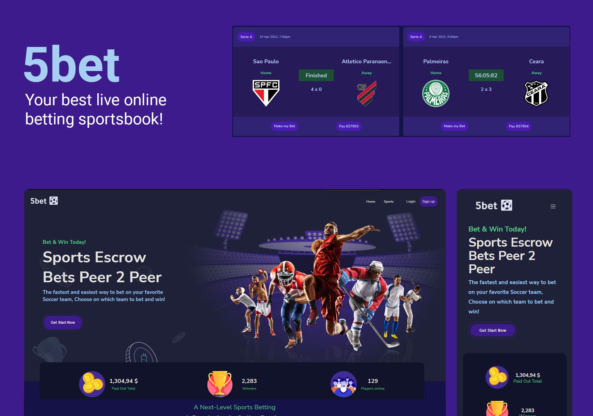

<h1 align="center">
  
</h1>
<br>
<p align="center">
  <a href="#-projeto">Projeto</a>&nbsp;&nbsp;&nbsp;|&nbsp;&nbsp;&nbsp;
  <a href="#-tecnologias">Tecnologias</a>&nbsp;&nbsp;&nbsp;|&nbsp;&nbsp;&nbsp;
  <a href="#-features">Features</a>&nbsp;&nbsp;&nbsp;|&nbsp;&nbsp;&nbsp;
  <a href="#-layout">Layout</a>&nbsp;&nbsp;&nbsp;|&nbsp;&nbsp;&nbsp;
  <a href="#-executando-o-projeto">Executando o projeto</a>&nbsp;&nbsp;&nbsp;|&nbsp;&nbsp;&nbsp;
  <a href="#memo-licença">Licença</a>
</p>

<br>


<p align="center">
  
  
  
  
</p>

<p align="center">
  <a href="https://capstone-group2-alex-eight.vercel.app/">Clique aqui</a> para acessar a versão web
</p>

## ✨ Projeto

Five Bet

## 🚀 Tecnologias

Esse projeto foi desenvolvido com as seguintes tecnologias/bibliotecas:

<table border="0">
 <tr>
<td> HTML5</td>
<td> CSS3</td>
<td> TypeScript</td>
<td> Java</td>
<td> React</td>
    </tr>
  <tr>
<td> Continuous Delivery</td>
<td> Spring Security</td>
<td> Springboot</td>
<td> Spring JPA</td>
<td> PostgreSQL</td>
 </tr>
</table>

## 🌟 Features

-   [ ] 100% responsivo em resoluções até 4k.
-   [ ] Exportação dos filtros para SVG, PNG ou CSV.
-   [ ] Gráficos em barras e em pizza para melhor visualização.
-   [ ] Paginação para suportar alto volume de dados.

## 🎨 Layout

 Este projeto não foi desenvolvido a partir de um figma.

## 👨🏻‍💻 Executando o projeto

Utilize o **yarn** ou o **npm install** para instalar as dependências do projeto.
Em seguida, inicie o projeto.

Iniciando a versão web:

```cl
yarn start ou npm run dev
```

## :memo: Licença

Esse projeto está sob a licença MIT. Veja o arquivo [LICENSE](./LICENSE.md) para mais detalhes.

---
